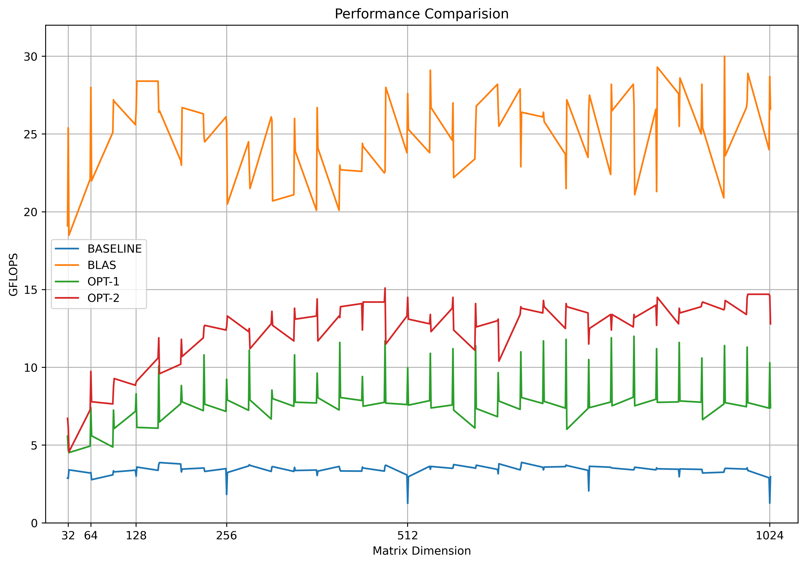
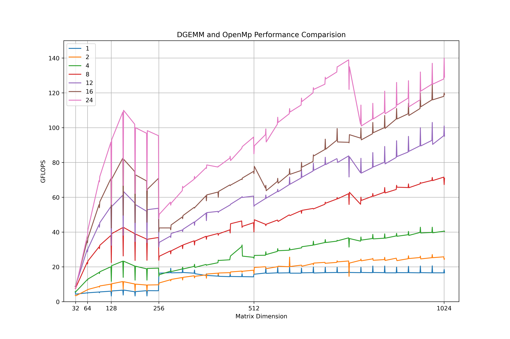

# Python HPC Plot

Plot HPC comparision figure with Python.

## Demo

| Fig 1 for dir `data` | Fig 2 for dir `data2` |
|----------------------|-----------------------|
|   |    |

## Install

```bash
pip install matplotlib
```

## Usage

```bash
git clone https://github.com/XavierJiezou/python-hpc-plot.git
cd python-hpc-plot
```

Overwrite the dir `data` and run `python main.py` to get your figure like demo fig 1.

or

Overwrite the dir `data2` and run `python main2.py` to get your figure like demo fig 2.
