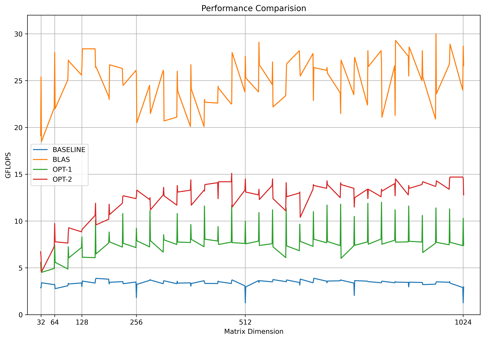
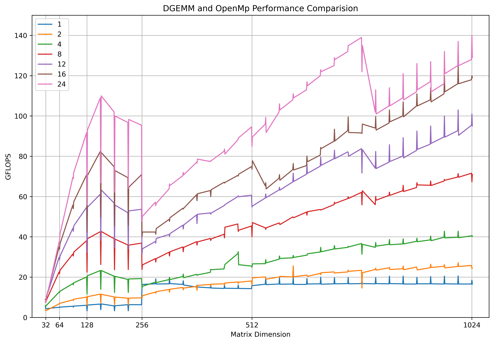
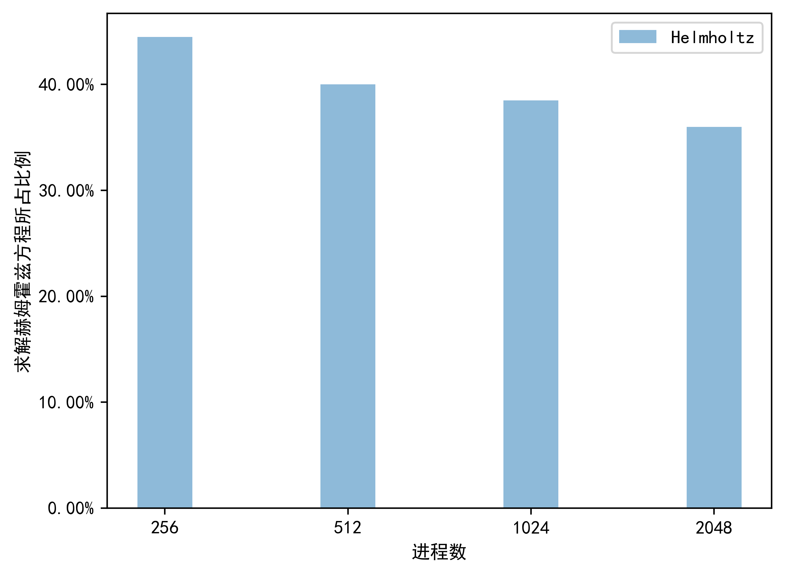
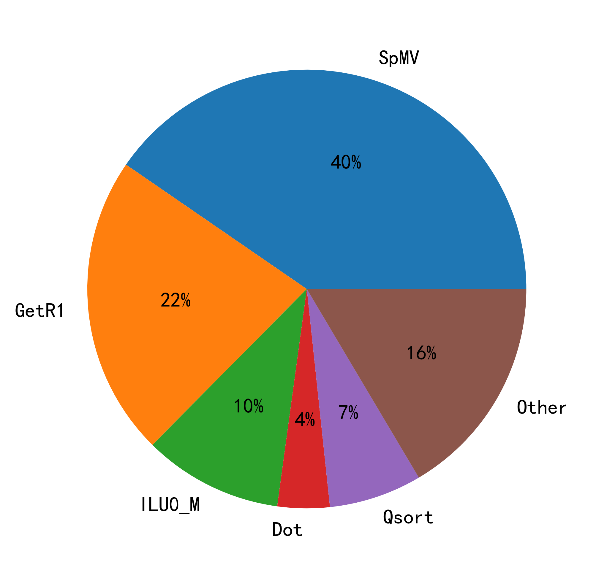
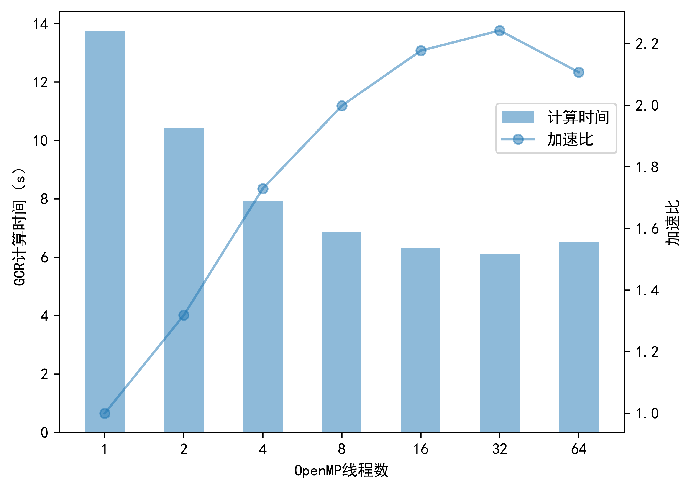

# Python HPC Plot

Plot HPC comparision figure with Python.

## Demo

| Fig 1 | Fig 2 | Fig 3 | Fig 4 | Fig 5 |
|----------------------|-----------------------|-----------------------|-----------------------|-----------------------|
|   |    |    |    |    |

## Install

```bash
pip install matplotlib
```

## Usage

```bash
git clone https://github.com/XavierJiezou/python-hpc-plot.git
cd python-hpc-plot
```

Overwrite the dir `./data/data*` and run `python ./examples/main*.py` to get your figure like demo fig *.

## Contributors

- Code: Xuechao Z
- Data: `data1` from Jiaohao T, `data2` from Wenxuan Z and `data3, 4, 5` from Dongqiang H
